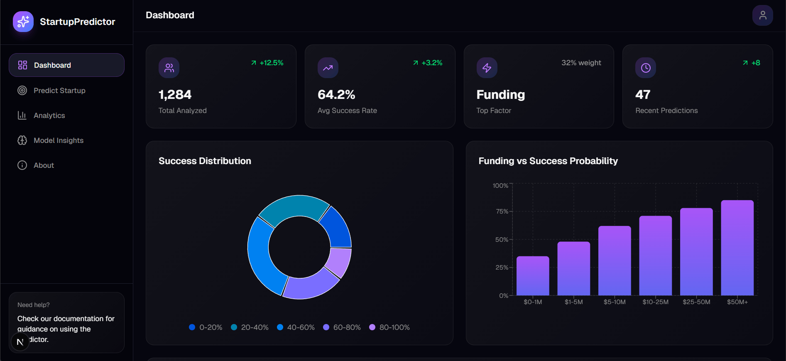

# 🚀 Startup Predictor

**AI-Powered Platform for Startup Success Prediction, Idea Analysis, and Investor Matching**

[](https://nextjs.org)
[](https://react.dev)
[](https://typescriptlang.org)
[](https://tailwindcss.com)

Predict your startup's success score, get AI-driven analysis, connect with investors, and join a vibrant community of founders and VCs.

## ✨ Key Features

- **🎯 Startup Success Prediction**: ML-powered scoring based on idea, market, team, and traction.
- **📊 AI Idea Analysis**: SWOT, market size, competitor insights powered by Gemini AI.
- **🤝 Investor & Founder Matching**: Network, pitch ideas, schedule meetings.
- **💬 Community Hub**: Discussions, saved posts, notifications, messaging.
- **📈 Dashboards**: Investor reports, analytics, history tracking.
- **⚡ Full-Stack**: Real-time results, MongoDB persistence, exportable reports.

## 📱 Screenshots

| Predict Page | Dashboard | Analysis Results |
|--------------|-----------|------------------|
|  |  <!-- Update with actual screenshot --> |  <!-- Capture and add --> |

## 🚀 Quick Start

### 1. Clone & Install Frontend
```bash
git clone <repo>
cd startup-predictor-main
npm install
npm run dev
```
Open [http://localhost:3000](http://localhost:3000)

### 2. Start ML Service (in new terminal)
```bash
cd ml-service
python -m venv venv  # or .venv
source venv/bin/activate  # Linux/Mac: source venv/bin/activate  # Windows: venv\\Scripts\\activate
pip install -r requirements.txt
uvicorn main:app --reload --port 8000
```

**Set `.env.local` (frontend):**
```
ML_API_URL=http://127.0.0.1:8000
MONGODB_URI=your_mongo_uri
```

**Set `ml-service/.env`:**
```
MONGO_URI=your_mongo_uri
GEMINI_API_KEY=your_key  # Optional: falls back gracefully
```

## 🛠 Tech Stack

```
Frontend: Next.js 16 (App Router), React 19, TypeScript, Tailwind CSS, Radix UI
Backend: Next.js API Routes + FastAPI (Python ML)
Database: MongoDB
AI/ML: scikit-learn, Gemini API
Deployment: Vercel (frontend), Render/Heroku (ML service)
```

## 🌐 Deploy

- **Frontend**: Vercel (one-click from GitHub).
- **ML Service**: Render, Railway, or Fly.io (Python/FastAPI support).
- Update `ML_API_URL` in production env.

<details>
<summary>👨‍💻 Local Development (Advanced)</summary>

- Linting: `npm run lint`
- Build: `npm run build`
- Type check: `npx tsc --noEmit`
- ML checks: `pip check` & `python -m compileall .` in ml-service/

See project structure in repo tree.

</details>

## 🤝 Contributing

1. Fork & PR.
2. Follow existing code style.
3. Test changes locally.

## 📄 License

MIT License - feel free to use and modify!

---

⭐ **Star this repo if it helps your startup journey!**  
💬 [Join the community discussions](http://localhost:3000/community)

